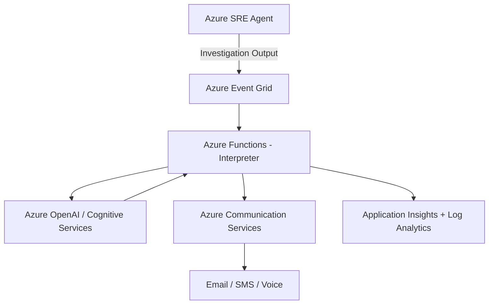

# Azure SRE Agent Intelligence Interpreter & Notifier

**Intelligent interpretation and multi-channel notifications for Azure SRE Agent findings.**

This project connects **Azure SRE Agent** with **Azure AI Foundry** (Azure OpenAI + Cognitive Services) to interpret investigation results and remediation proposals, then delivers clear, actionable notifications via **Azure Communication Services** (Email, SMS, and Voice).

---

## Table of Contents
- [Overview](#overview)
- [Key Features](#key-features)
- [Architecture](#architecture)
- [Tech Stack](#tech-stack)
- [Prerequisites](#prerequisites)
- [Repository Structure](#repository-structure)
- [Deployment (IaC with Bicep)](#deployment-iac-with-bicep)
- [Local Development](#local-development)
- [Configuration](#configuration)
- [Usage & Testing](#usage--testing)
- [Monitoring & Observability](#monitoring--observability)
- [Security & Compliance](#security--compliance)
- [Contributing](#contributing)
- [License](#license)

---

## Overview

Azure SRE Agent excels at investigation and root cause analysis, but raw outputs can be highly technical. This solution adds an **AI interpretation layer** that translates findings into plain-language summaries and then routes rich notifications to the right people through multiple channels.

**Primary Use Case**: Reduce on-call fatigue by delivering concise, prioritized, and actionable alerts with one-click approval links.

---

## Key Features

- **AI-Powered Interpretation**
  - Summarization, severity assessment, business impact analysis
  - Plain English explanations + recommended actions
  - Content safety & grounding checks

- **Multi-Channel Notifications** (via Azure Communication Services)
  - Rich HTML **Email**
  - Concise **SMS**
  - Voice (TTS) **Phone Calls**

- **Event-Driven Architecture** (Event Grid / Service Bus)
- **Full Infrastructure as Code** using Bicep
- **Observability** built-in with Application Insights
- **Secure by default** – Managed Identities, RBAC, Key Vault

---

## Architecture



1. **Azure SRE Agent** raises an investigation/incident finding (root cause, proposed mitigations).
2. The finding is published to **Event Grid**, which triggers the **Interpreter** Function.
3. The Interpreter calls **Azure OpenAI / Cognitive Services** to summarize the finding, assess severity/impact, and produce recommended actions.
4. The structured result is handed to the **Notifier** Function, which composes and sends Email/SMS/Voice via **Azure Communication Services**.
5. Every step is logged to **Application Insights** and **Log Analytics** for a full audit trail.

---

## Tech Stack

| Layer | Technology |
|---|---|
| IaC | Bicep |
| Compute | Azure Functions (Node.js 20) |
| AI | Azure OpenAI + Azure AI Foundry (Cognitive Services) |
| Notifications | Azure Communication Services (Email, SMS, Call Automation) |
| Messaging | Azure Event Grid |
| Storage | Azure Storage |
| Monitoring | Application Insights, Azure Monitor, Log Analytics |
| CI/CD | GitHub Actions |

---

## Prerequisites

- [Node.js 20+](https://nodejs.org/)
- [Azure CLI](https://learn.microsoft.com/cli/azure/install-azure-cli) with the Bicep extension (`az bicep install`)
- [Azure Functions Core Tools v4](https://learn.microsoft.com/azure/azure-functions/functions-run-local)
- An Azure subscription with permissions to deploy Communication Services, Cognitive Services, Functions, Storage, and Event Grid resources

---

## Repository Structure

```
azure-maf-oncall/
├── .github/
│   └── workflows/
│       ├── ci-cd.yml              # Lint + test on push/PR
│       └── deploy-bicep.yml       # OIDC login + Bicep deployment
├── infra/
│   ├── main.bicep
│   ├── modules/
│   │   ├── sre-agent.bicep        # Event Grid ingestion topic
│   │   ├── ai-foundry.bicep       # Cognitive Services / Azure OpenAI
│   │   ├── acs.bicep              # Communication Services
│   │   ├── storage.bicep
│   │   └── monitoring.bicep       # Log Analytics + App Insights
│   ├── parameters/
│   │   ├── dev.parameters.json
│   │   ├── staging.parameters.json
│   │   └── prod.parameters.json
│   └── bicepconfig.json
├── src/
│   ├── functions/
│   │   ├── Interpreters/
│   │   │   └── interpretFinding.js    # Event Grid trigger -> Azure OpenAI -> queue
│   │   ├── Notifiers/
│   │   │   ├── notifyOnCall.js        # Storage queue trigger -> Email/SMS/Voice
│   │   │   └── callEventsWebhook.js   # HTTP trigger -> plays TTS on call connect
│   │   └── Shared/
│   │       ├── config.js
│   │       ├── openAiClient.js
│   │       ├── acsClients.js
│   │       ├── interpretation.js
│   │       ├── emailTemplate.js
│   │       └── notify.js
│   ├── agents/                    # Custom sub-agents/tools
│   ├── services/                  # Business logic
│   └── utils/                     # Shared helpers
├── tests/                         # Jest unit tests (mocked OpenAI/ACS clients)
├── docs/                          # PRD, architecture, runbooks
├── scripts/                       # Deployment/setup scripts
├── host.json
├── local.settings.json.example
├── .env.example
└── package.json
```

---

## Deployment (IaC with Bicep)

Deploy the full stack to a resource group:

```bash
az group create --name rg-sre-oncall-dev --location eastus

az deployment group create \
  --resource-group rg-sre-oncall-dev \
  --template-file infra/main.bicep \
  --parameters infra/parameters/dev.parameters.json
```

Repeat with `staging.parameters.json` / `prod.parameters.json` for other environments. The [deploy-bicep.yml](.github/workflows/deploy-bicep.yml) workflow automates this via OIDC federated credentials on push to `main` (path-filtered to `infra/**`) or manual dispatch.

---

## Local Development

```bash
npm install
cp local.settings.json.example local.settings.json   # fill in Azure OpenAI / ACS / Event Grid values
npm start                # runs Azure Functions locally via Core Tools
```

`local.settings.json` is what the Functions host reads at runtime (`.env.example` documents the same variables for non-Functions contexts like tests/scripts).

Run linting and tests:

```bash
npm run lint
npm test
```

---

## Configuration

Environment variables (see [.env.example](.env.example)):

| Variable | Description |
|---|---|
| `AZURE_OPENAI_ENDPOINT` | Azure OpenAI / AI Foundry endpoint |
| `AZURE_OPENAI_API_KEY` | Azure OpenAI API key |
| `AZURE_OPENAI_DEPLOYMENT` | Model deployment name |
| `ACS_CONNECTION_STRING` | Azure Communication Services connection string |
| `ACS_SENDER_EMAIL` | Verified sender email domain address |
| `ACS_SENDER_PHONE_NUMBER` | ACS phone number for SMS/Voice |
| `ONCALL_EMAIL` | Destination email address for notifications |
| `ONCALL_PHONE_NUMBER` | Destination phone number for SMS/Voice notifications |
| `CALL_EVENTS_CALLBACK_URL` | Public URL of the deployed `callEventsWebhook` function (required for voice) |
| `APPROVAL_BASE_URL` | Base URL for remediation approval links (optional) |
| `EVENT_GRID_TOPIC_ENDPOINT` | Event Grid topic endpoint for SRE Agent ingestion |
| `EVENT_GRID_TOPIC_KEY` | Event Grid topic access key |
| `APPLICATIONINSIGHTS_CONNECTION_STRING` | App Insights connection string |
| `ENVIRONMENT` | `dev` / `staging` / `prod` |

In Azure, these are wired as Function App settings by [infra/modules/functions.bicep](infra/modules/functions.bicep) and should be sourced from Key Vault references in production rather than plaintext app settings.

---

## Usage & Testing

1. Point your Azure SRE Agent (or a test harness) at the Event Grid topic output by `sre-agent.bicep`.
2. Publish a sample investigation payload (findings, root cause, proposed mitigations) as the event's `data`.
3. [`interpretFinding`](src/functions/Interpreters/interpretFinding.js) (Event Grid trigger) summarizes it via Azure OpenAI and writes the structured result to the `interpreted-findings` storage queue.
4. [`notifyOnCall`](src/functions/Notifiers/notifyOnCall.js) (storage queue trigger) sends Email, SMS, and a TTS phone call via ACS. Voice playback is driven by [`callEventsWebhook`](src/functions/Notifiers/callEventsWebhook.js), which Call Automation invokes once the call connects.
5. If every channel fails (or all are unconfigured), the queue message is retried and eventually lands in the `interpreted-findings-poison` queue rather than being silently dropped.
6. Verify delivery, and check the trace in Application Insights.

Unit tests live under [tests/](tests/) and run via `npm test` (Jest) — they cover severity/action validation in the Interpreter, per-channel skip/send behavior in the Notifier, and HTML escaping in the email template. They mock the Azure OpenAI and ACS clients, so no live Azure resources are required to run them.

---

## Monitoring & Observability

- **Application Insights** captures function execution traces, dependencies, and failures end-to-end.
- **Log Analytics** aggregates logs for querying and alerting across environments.
- Alerts should be configured on notification delivery failures and Interpreter error rates to avoid silent gaps in on-call coverage.

---

## Security & Compliance

- No credentials, tokens, or secrets committed to the repository or git history.
- Function Apps use **System-Assigned Managed Identity**; prefer Key Vault references over plaintext app settings for secrets.
- GitHub Actions authenticate to Azure via **OIDC / Workload Identity Federation** — no long-lived cloud credentials in CI.
- Branch protection on `main` requires review and blocks force-push/deletion.
- Dependabot alerts, automated security updates, secret scanning, and CodeQL are enabled on this repository.
- See [SECURITY.md](SECURITY.md) for the vulnerability reporting process.

---

## Contributing

See [CONTRIBUTING.md](CONTRIBUTING.md) and [CODE_OF_CONDUCT.md](CODE_OF_CONDUCT.md).

---

## License

Licensed under the [Apache License 2.0](LICENSE).
